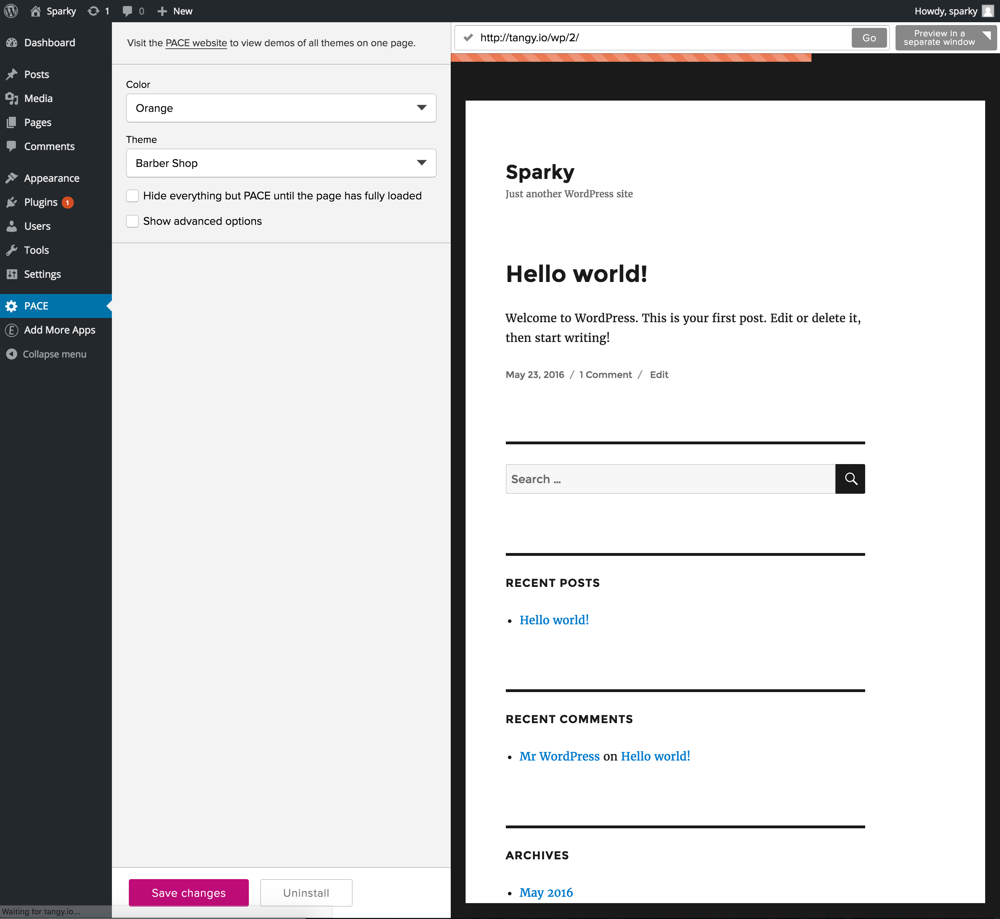

## Eager for Wordpress

This plugin is used to make the installation and management of [Eager](https://eager.io) even easier on Wordpress sites.

**It is not installable directly, it must be downloaded from [eager.io](https://eager.io/wordpress)**

You can create a custom build which includes a site id by downloading:

##### `https://packager.eager.io/wordpress/v2.0.1/plugin.zip?siteId=SITE_ID`

Where `SITE_ID` is replaced with your site id.

#### Testing (Mac OS)

1. [Set up MAMP and install Wordpress locally](http://codex.wordpress.org/Installing_WordPress_Locally_on_Your_Mac_With_MAMP)
1. Take note of the location of the folder in which you install wordpress. (For example: `~/Sites/wordpress/`.)
1. Download this repo.
1. Create a `.zip` file of the repo
1. Visit `/wp-admin/plugin-install.php?tab=upload` and uplaod the zip file.
1. Activate the plugin on the installation success page.

#### Contributing

- If you make changes to `readme.txt`, [validate them](http://wordpress.org/plugins/about/validator/).
